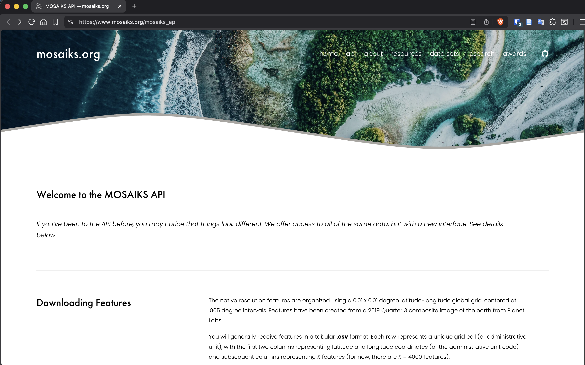
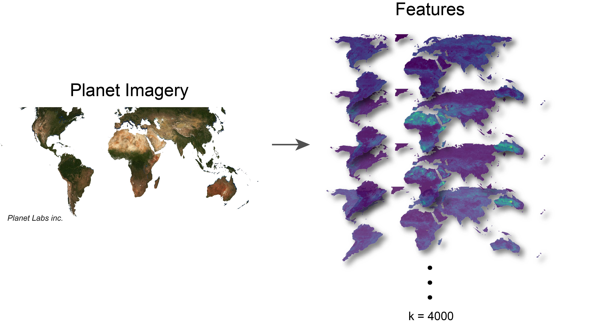
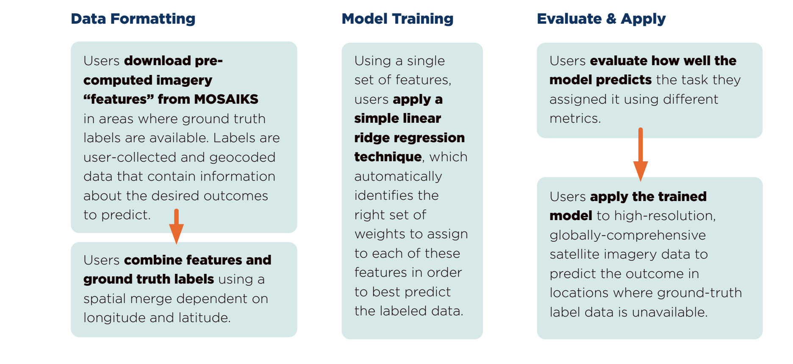

# Access MOSAIKS {#sec-intro-api}

```{r}
#| echo: false
#| results: "asis"

source("../../_common.R")
status("review_en")
```

## Introduction

At its core, MOSAIKS requires two main inputs: 

1. Features computed from satellite imagery

1. Ground truth label data. 

This chapter explains how to access precomputed MOSAIKS features through the API. Our aim is to make these features as accessible as possible so that the majority of users do not have to worry about the technical details of satellite imagery processing, which is explained in later chapters.

To this end, we have worked to develop multiple ways to access MOSAIKS features:

| Option | Imagery Source | Spatial Coverage | Spatial Resolution | Temporal Resolution | Weighting | 
|--------|----------------|------------------|--------------------|---------------------|-----------|
| [MOSAIKS API](https://www.mosaiks.org/mosaiks_api) | [Planet Labs Visual Basemap](https://developers.planet.com/docs/data/visual-basemaps/) | Global land areas | 0.01° | 2019 Q3 | Unweighted | 
| [MOSAIKS API](https://www.mosaiks.org/global_grids) | [Planet Labs Visual Basemap](https://developers.planet.com/docs/data/visual-basemaps/) | Global land areas | 0.1°, 0.25°, 1° | 2019 Q3 | Area & population | 
| [MOSAIKS API](https://www.mosaiks.org/precomputed) | [Planet Labs Visual Basemap](https://developers.planet.com/docs/data/visual-basemaps/) | Global land areas | ADM0, ADM1, ADM2 | 2019 Q3 | Area & population | 
| [Rolf et al 2021](https://codeocean.com/capsule/6456296/tree/v2) | [Google Static Maps](https://developers.google.com/maps/documentation/maps-static/start) | Continental United States (~100k locations) | 0.01° | 2019 | unweighted | 
| @sec-features-computing | Any - see @sec-satellite-imagery  | User-defined | User-defined | User-defined | User-defined | 

: Summary of MOSAIKS feature sources. The weighting column indicates that the features were generated at 0.01 degree resolution and weights are applied when aggregating to lower resolutions. There are two available weighting schemes based on area of the aggregation polygon, or by the population of the the aggregation polygon. More details can be found at [MOSAIKS API](https://www.mosaiks.org/mosaiks_api). {#tbl-features-options}

::: {.callout}
- Chapters -@sec-intro-compute through -@sec-labels-demo focus on publicly available features 
- Chapters -@sec-satellite-imagery through -@sec-features-demo cover computing custom features from imagery
:::

The MOSAIKS API should be considered the primary way to access features. It is a user-friendly interface that allows you to download features for any location on Earth. The API is designed to be accessible to users with a range of technical backgrounds, from beginners to experts. For more details on what features are available on the API, see @sec-features-api.

However, there are many settings where users will want or need to compute their own customized features. @sec-features-computing guides readers through this process.

## MOSAIKS API

::: {.callout-tip}
# MOSAIKS API Link

Features can be found on [mosaiks.org](https://www.mosaiks.org/mosaiks_api), but first users will need to create an account with [Redivis](https://redivis.com/), which hosts the API. The API is free to use for all users.
:::

The MOSAIKS API is a user-friendly interface that allows you to download features for any land location on Earth. The API is designed to be accessible to users with a range of technical backgrounds, from beginners to experts. To take advantage of the API, you will need to register for an account with Redivis.

### Register for an account

Visit [redivis.com](https://redivis.com/). Follow the onscreen instructions to create an account. You can use your email address or sign up with Google. 

{#fig-api-login} 

Once registered, you can log in and return to [mosaiks.org](https://www.mosaiks.org/mosaiks_api) to begin downloading MOSAIKS features.

{#fig-api-landing}

### API resources

From the landing page, you can read additional information about MOSAIKS and access resources to help you get started. 

The API contains the following pages:

| Page | Description |
|------|:------------|
| [Home](https://api.mosaiks.org) | Landing page for the API. Contains general information about using MOSAIKS and the API |
| [Full resolution Query](https://github.com/Global-Policy-Lab/mosaiks_tutorials/blob/main/01_querying_redivis.ipynb) | Precomputed features at 0.01 degree resolution, follow notebook for details **(Advanced)**.  |
| [Precomputed Files](https://www.mosaiks.org/precomputed) | Precomputed features at administrative boundary scales |
| [Global Grids](https://mosaiks.org/global_grids) | Precomputed and area or population features at 0.1° and 1° resolution |
| [HDI](https://www.mosaiks.org/hdi) | Global Human Development Index (HDI) estimates at the municipality and grid levels |
| [Resources](https://www.mosaiks.org/resources) | Example Python and R notebooks for using the MOSAIKS framework |

: MOSAIKS API pages and descriptions. {#tbl-api-pages tbl-colwidths="[25,75]"}


### API features 

Currently the MOSAIKS API has a single set of global features (with several aggregation levels). The features are freely available to the public for download; this is the fastest and easiest way to begin using MOSAIKS. 

The API features use input imagery from Planet Labs, Inc. [Visual Basemap](https://developers.planet.com/docs/basemaps/) Global Quarterly 2019 (quarter 3) product. Image quality, and therefore  feature quality, may be affected by local conditions. For example, an area undergoing a rainy season in the third quarter (July to September), is likely to contain image artifacts from cloud cover. This will in turn effect the feature calculations. For more details on the input imagery @sec-satellite-imagery.

Given the static nature of the API, the easiest way to get started with MOSAIKS is to have label data for a recent time period (ideally from 2019 for fast changing labels, or a close year for more steady labels). 

{#fig-api-features}

The MOSAIKS features are created using a 0.01 x 0.01 degree latitude-longitude global land grid. These are the native features available for download from the API, but it also offers pre-aggregated features at 0.1 and 1 degree resolution, as well as administrative boundaries (ADM0, ADM1, and ADM2).

::: {.callout-note}
Using MOSAIKS for time series data is possible and can work well, however this currently requires computing your own custom features. See @sec-features-computing and @sec-model-time for more information.
:::

### High resolution features

The file query and map query are the two methods to obtain the high resolution (0.01 degree) features through the API. For simplicity, we store these features in a tabular format with latitude and longitude coordinates. These coordinates are the center of each grid cell.

When you download the high resolution features (0.01 degree), you will receive them in a tabular format where:

- Each row (*N*) represents a unique grid cell
- The first two columns contain latitude and longitude coordinates (grid centroids)
- The remaining columns represent *K* features (currently *K* = 4000 features)

::: {.callout-tip}
Use [geojson.io](https://geojson.io/#new&map=2/0/20) to find the bounding box coordinates for your area of interest.
:::

### Aggregated features

Many users may find it easier to work with features aggregated to some level. The MOSAIKS API offers pre-aggregated features to accommodate these needs. The API offers several levels, including larger grid cells (0.1 and 1 degree) or summarized to administrative boundaries (ADM0, ADM1, and ADM2). These files are available for download as either single or chunked files depending on the resolution.

{#fig-api-aggregated}

#### Weighting schemes

At each level of aggregation, we offer area weighted features and population weighted features. Population weights are from the Gridded Population of the World ([GPWv4](https://earthdata.nasa.gov/data/projects/gpw)) population density dataset. The area weighting scheme is based on the area of the high resolution grid cells.

#### When to use aggregated features

The aggregated features are particularly useful in a few scenarios:

1. You have data at a scale larger than the 0.01 degree grid cells. Many datasets come at the country, state, or county level. 

1. Your data has a lot of noise that can be smoothed out by aggregating to a larger scale. A common example of this might be household survey data that is noisy at the individual level but smooths out when aggregated to the village or district level.

1. You want to do global analysis and don't have the computational resources to work with the full 0.01 degree grid cells.

In all cases using the pre-aggregated features can save you time and computational resources. 

> **Scenario:** You are working with a Living Standards Measurement Study - Integrated Surveys on Agriculture ([LSMS-ISA](https://www.worldbank.org/en/programs/lsms/initiatives/lsms-ISA)). This dataset has survey data with geographic coordinates at the household level. To protect, the privacy of the respondents, the data is jittered within a 5 km radius but it always remains within local administrative boundaries. You can therefore summarize your labels to the administrative units and build a model with the aggregated features. 

::: {.callout-tip}
If you want to make high resolution predictions, with low resolution label data, you can build your model with aggregated features and use the high resolution features to make predictions. This will be covered in more detail in@sec-model-space. 
:::

## Using MOSAIKS features for prediction

::: {.callout-tip}
This is a brief overview. Detailed instructions appear later in the manual (@sec-model-choice).
:::

Basic workflow:

1. Obtain ground truth measurements ("labels"; see @sec-labels-100-maps)
2. Download matching features (see @sec-features-api for more details).
3. Spatially merge labels and features (see @sec-labels-data-prep)
4. Use regression to model relationship between imagery and outcome (see @sec-model-choice)
5. Use regression results to predict outcome in new locations (see @sec-model-choice)

You can experiment with various machine learning approaches in the regression step. For beginners, we recommend starting with our example Jupyter notebook (@sec-intro-demo) that demonstrates a simple ridge regression approach (suitable for both R and Python users).

{#fig-mosaiks-flow}

This topic will be covered in greater depth in later chapters (see @sec-model-choice). In the next chapter, you will see a simple MOSAIKS workflow which replicates the results of Rolf et al. 2021. 

## Citation requirements

When referring to the MOSAIKS methodology or when generating MOSAIKS features, please reference: 

> Rolf, E., Proctor, J., Carleton, T., Bolliger, I., Shankar, V., Ishihara, M., Recht, B., & Hsiang, S. (2021). A generalizable and accessible approach to machine learning with global satellite imagery. *Nature Communications* , 12(1), 4392. [doi.org/10.1038/s41467-021-24638-z](https://doi.org/10.1038/s41467-021-24638-z)

<details><summary>BibTeX Citation</summary>
```bibtex
@article{rolf_etal_2021,
    title = {A Generalizable and Accessible Approach to Machine Learning with Global Satellite Imagery},
    author = {Rolf, Esther and Proctor, Jonathan and Carleton, Tamma and Bolliger, Ian and Shankar, Vaishaal and Ishihara, Miyabi and Recht, Benjamin and Hsiang, Solomon},
    date = {2021-12},
    journaltitle = {Nature Communications},
    shortjournal = {Nat Commun},
    volume = {12},
    number = {1},
    pages = {4392},
    issn = {2041-1723},
    doi = {10.1038/s41467-021-24638-z},
    url = {http://www.nature.com/articles/s41467-021-24638-z},
    langid = {english}
}
```
</details>

If using features downloaded from the API, please reference, in addition to the publication above, the MOSAIKS API:

> Carleton, T., Chong, T., Druckenmiller, H., Noda, E., Proctor, J., Rolf, E., & Hsiang, S. (2022). Multi-task observation using satellite imagery and kitchen sinks (MOSAIKS) API. Version 1.0. [mosaiks.org](https://mosaiks.org).

<details><summary>BibTeX Citation</summary>
```bibtex
@misc{MOSAIKS_API,
    author = {Carleton, Tamma and Chong, Trinetta and Druckenmiller, Hannah and Noda, Eugenio and Proctor, Jonathan and Rolf, Esther and Hsiang, Solomon},
    title = {Multi-Task Observation Using Satellite Imagery and Kitchen Sinks (MOSAIKS) API},
    url = {https://mosaiks.org},
    version = {1.0},
    year = {2022},
}
```
</details>

::: {.callout-note}
# Looking forward
In the next chapter, we'll set up our computing environment using Google Colab. This course uses Colab to demonstrate various aspects of MOSAIKS, in a free and accessible environment.
:::

