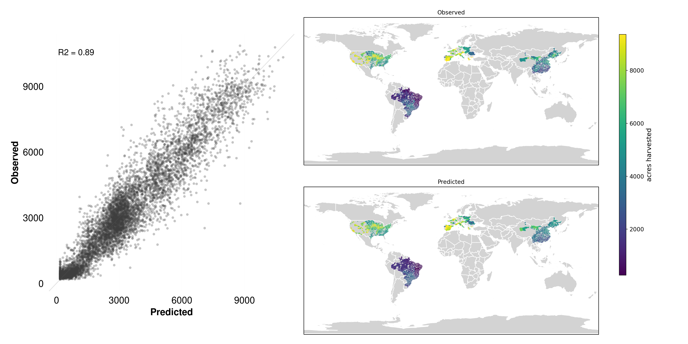
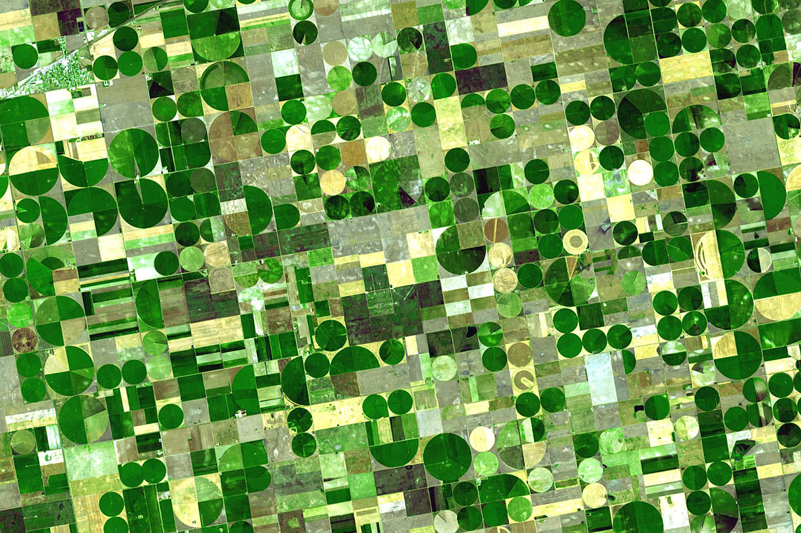
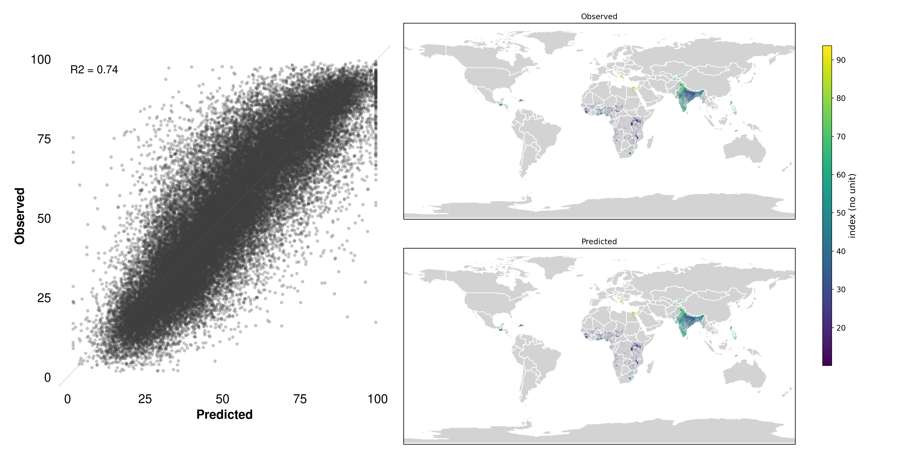
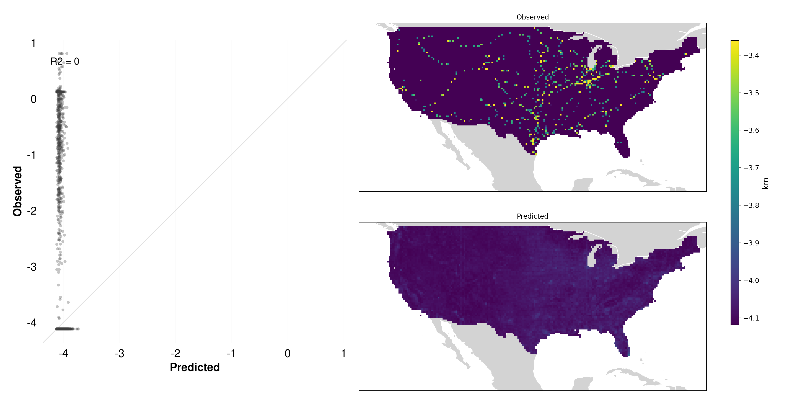
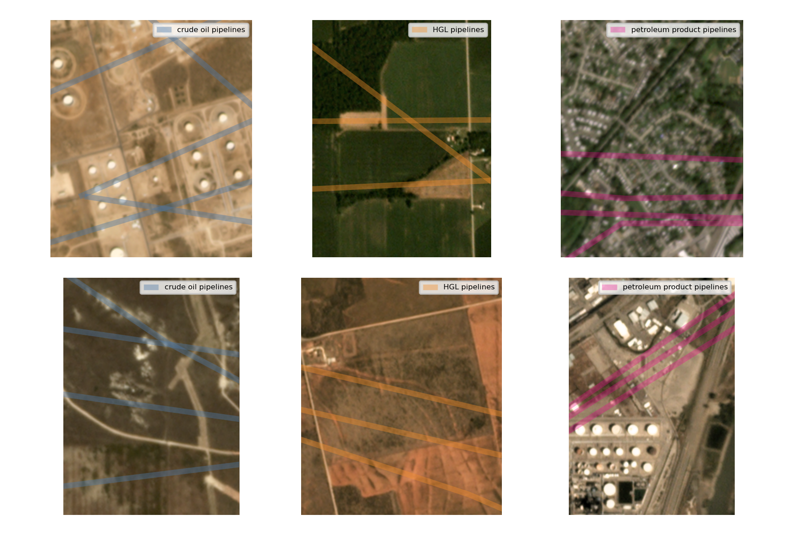
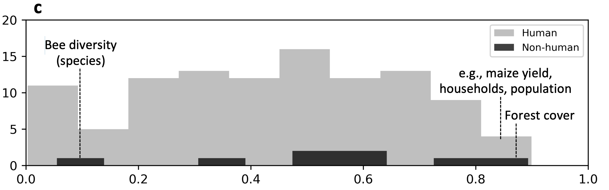

# What labels work? {#sec-labels-100-maps}

```{r}
#| echo: false
#| results: "asis"

source("../../_common.R")
status("review_en")
```

## Overview

MOSAIKS is a designed to be useful for predicting anything that may be visible in satellite imagery. Some things are easier to predict than others, but the system is designed to be flexible. For instance, some variables can be seen directly in the imagery itself, such as forest cover, which clearly emits a visible green signal. Other outcomes can only be predicted through indirect relationships between imagery data and labels. For example, income and housing price are not themselves directly visible in imagery, but their values can be reliably estimated from objects (e.g., cars), textures (e.g., roofing material), and colors (e.g., grey road infrastructure) contained within the imagery. 

{#fig-army-knife width="300px"}

In this chapter we will discuss a new working paper from @proctor_etal_2025 that explores the question: **What Can Satellite Imagery and Machine Learning Measure?** This paper investigates over 100 different outcomes, reporting predictive performance for each using MOSAIKS. We will discuss the results of a selection of these outcomes in detail, and provide a brief overview of the rest. Of course, this list of outcomes is not exhaustive and reported performance can differ substantially across contexts and in particular with varying quality of ground truth data. We show these results as an initial investigation of what might be possible with SIML using MOSAIKS, but encourage users to conduct their own experiments as results are likely to differ in new settings. The pre-print of Proctor et al. will be posted here when publicly available. 

### What makes good label data?

Before we get started, it's important to understand what makes good label data. For optimal performance with MOSAIKS, label data should have several key characteristics:

- Accurate geographic location information
- Appropriate spatial resolution (typically ≥1km²)
- Reasonable temporal alignment with imagery features
- Sufficient sample size (generally ≥300 observations; the more the merrier!)
- Observable connection to surface features (directly or indirectly)

The answer will depend depend largely on the source of the imagery features. For example, when the satellite image was taken, what resolution the pixels are, how the imagery is processed, and how the features are extracted. In general, the more directly observable the label is in the imagery (in time and space), the better the performance is likely to be. 

### Original publication 

In @rolf_etal_2021, the authors tested MOSAIKS on 7 outcomes: forest cover, income, housing price, population density, nighttime luminosity, and elevation. While MOSAIKS has great potential to improve access to satellite-based prediction in data-sparse environments, the original paper focused on demonstrating performance in the continental United States where high-quality training data was readily available. 

```{r}
#| echo: false
#| results: "asis"

labels <- readr::read_csv("../tables/rolf_variables.csv", show_col_types = FALSE)

# Build the tabset using knit_child with inline text
panels <- lapply(seq_len(nrow(labels)), function(i) {
    row <- labels[i, ]
    knitr::knit_child(text = c(
        glue::glue("## {row$variable}"),
        "",
        glue::glue("{{#{row$fig_id}}}"),
        ""
    ), envir = environment(), quiet = TRUE)
})

cat("::: {.panel-tabset}\n\n")
cat(unlist(panels), sep = "\n")
cat("\n:::\n")
```

## Going global

While the results showed significant promise and demonstrated the potential of MOSAIKS, the true test is in the application to new outcomes and new geographies. To test the global applicability of MOSAIKS, across a diverse set of outcomes, there were 2 primary things that needed to happen:

::: {.panel-tabset}

# Create global satellite features

The creation of a global set of satellite features. These are the features available on the MOSAIKS API, more details on their construction can be found in @sec-features-api.

{#fig-api-features}

# Collect 115 labels 

Collecting and curating a large set of outcomes with diversity in spatial structures and categories

| **Category**           | **Number of Labels** | **Example Label**             |
|------------------------|----------------------|-------------------------------|
| Agricultural Assets    | 5                    | Agricultural land ownership   |
| Agriculture            | 16                   | Maize yield                   |
| Built Infrastructure   | 9                    | Buildings                     |
| Demographics           | 5                    | Median age                    |
| Education              | 10                   | Expected years of schooling   |
| Health                 | 15                   | Malaria in children           |
| Household Assets       | 21                   | Mobile phones                 |
| Income                 | 9                    | Human development index       |
| Natural Systems        | 8                    | Tree cover                    |
| Occupation             | 17                   | Unemployment                  |

: The authors selected 115 variables and grouped them into 10 categories. Each label was modeled with the same set of global satellite features (@fig-api-features). {#tbl-labels} 

:::

With this data in hand, the authors were able to test which variables can be effectively measured, what were the most compelling successes, and what were the modes of failure. This is a critical step in understanding the capabilities and limitations of MOSAIKS, and SIML more broadly. 


## Results

### Overall performance

The results of modeling each of the 115 variables with the same set of global satellite features are shown in @fig-100-maps-box and @fig-100-maps-scatter. The performance of each variable is measured using R², which indicates how well the MOSAIKS predictions match the observed values.

::: {.panel-tabset}

# Boxplot

![Performance of imagery-based mapping differs across variable categories and properties. All panels report out-of-sample performance ($R^2$) for 115 variables.Panel **a** shows the distribution of performance by category, ordered by mean performance. Performance for each variable is shown as a point, and visually summarized by a boxplot with the black horizontal line showing the median, box edges showing the interquartile range (IQR), and whiskers showing the most extreme data point within 1.5 times the IQR from the box edges. Panel **b** shows histograms of performance for variables that are either directly visible in imagery (light grey; e.g., forest cover) or only indirectly visible in imagery (black; e.g., years of schooling). Panels **c-e** show analogous histograms based on: **c** whether the variable represents a phenomenon produced primarily via human or non-human activity; **d** whether the variable represents a non-seasonal or seasonal phenomenon; and **e** the average native physical size of the ground truth measurements associated with each variable. Selected variables are identified in each panel to highlight examples of both high- and low-performing variables.](../../images/proctor_et_al_100_fig2.png){#fig-100-maps-box}

# Scatter plot

{#fig-100-maps-scatter}

# Prediction maps

![High-resolution national to global-scale maps of 115 distinct variables generated using a single set of features derived from one composite image of Earth. The center map shows the snapshot of global satellite imagery, provided by Planet Labs, Inc., that was used to produce a single set of task-agnostic imagery features following the MOSAIKS method in @rolf_etal_2021. All other maps show satellite-based predictions. Models are trained to learn the relationship between satellite imagery and each variable of interest in locations where measurements are available, and then applied globally. Predictions are shown only in locations where out-of-sample performance is estimated to be positive. For variables directly derived from human activity (e.g., child mortality), predictions are shown only in populated areas based on @ghs_pop_2020. Maps of variables are organized by category, with one example map in each category shown in a larger size.](../../images/proctor_et_al_100_fig1.png){#fig-100-maps-fig1}

# Table

```{r}
#| echo: false
#| label: tbl-all-variables
#| tbl-cap: "115 variables mapped using satellite imagery. Variables were chosen to span a diversity of socioeconomic and environmental categories and because publicly available data were available for model training and evaluation. $R^2$ is out-of-sample predictive performance comparing satellite-based predictions to “ground truth” measurements from traditional sources."

library(readr)
library(DT)

vars <- readr::read_csv("../tables/proctor_variables.csv", show_col_types = FALSE)

DT::datatable(vars,
  filter = "top",
)
```

:::

A few broad insights stand out:

1. **Substantial variation:** Even within the same category, we see varying degrees of predictive power. For instance, in the “Agriculture” category, some labels (such as high-level yield averages) are predicted quite accurately, while others (like certain niche crops or management practices) remain more elusive.

1. **Category differences:** Some categories have consistently higher R² scores. For instance, “Natural Systems” (e.g., tree cover) often score better because the patterns are more directly visible from above—think of large, contiguous forest areas contrasted with open fields or urban centers. On the other hand, “Occupation” or “Demographics” include variables (like unemployment rates) that are largely socio-economic in nature, requiring more indirect and subtle cues.

1. **Failure cases:** A few outcomes show near-random performance, suggesting that the satellite imagery features alone are insufficient to capture their spatial patterns, or that the signals are drowned out by noise (see Failures below).

This heterogeneity underscores an important takeaway: MOSAIKS is not a one-size-fits-all solution. Some phenomena lend themselves to easier detection via satellite data than others. Still, the ability to simultaneously handle over 100 different outcomes from a single feature set is itself a testament to MOSAIKS’ flexibility and global applicability.

### Successes

::: {.panel-tabset}

# Maize yield

::: {.panel-tabset}

## Results

Maize yield is one of the best-performing labels in the 100 maps experiment, with an R² value of 0.81. This means that MOSAIKS can explain 81% of the variance in maize yield across the study locations using only satellite imagery features. The predicted values closely match the observed values, indicating that MOSAIKS is able to capture the underlying patterns in the data effectively.

In the left-hand scatter plot of @fig-100-maps-maize-plot, the predicted yield values match well with the observed values, often clustering along the 45° line. On the right, we see that visually identifiable patterns in maize-growing regions are clearly reflected in the predicted maps. This strong alignment highlights how MOSAIKS can quickly yield robust predictions for outcomes that are clearly manifested in the satellite imagery.

{#fig-100-maps-maize-plot}

## Why it works

Crop yields are a classic use case for remote sensing because farmland for several reasons:

- **Direct visual signal:** Agricultural fields have characteristic features, including crop texture, canopy cover, and phenological (growth stage) patterns, all of which can be captured in the spectral and spatial signals from satellite images.

- **Spatial contiguity:** Large, contiguous fields of maize reduce noise and enable easier extraction of relevant features.

By measuring vegetation indices (e.g., NDVI, EVI), researchers gain insight into plant health, canopy density, and photosynthetic activity, all of which correlate strongly with agricultural productivity. This non-invasive, timely, and spatially comprehensive approach makes it invaluable for crop forecasting, detecting stress, and guiding resource allocation. Consequently, remote sensing has become a cornerstone in modern yield estimation methods for staple crops around the world. MOSAIKS is a natural extension of this trend, leveraging the latest in machine learning to extract actionable insights from satellite imagery.

{#fig-100-maps-maize-img}

## Data

The maize yield data comes from crop yield data collected at the second administrative level (e.g., counties in the US) from the United States, China, Brazil and the European Union. Yields are calculated as harvested grain divided by the planted area, though in some cases harvested area is used instead of planted area. The data covers years from 1983-2009, with the most recent available year used for each location.

:::

# International Wealth Index

::: {.panel-tabset}

## Results

Another notable success is the International Wealth Index (IWI; @fig-100-maps-iwi-plot). This composite measure of household wealth is derived from a variety of indicators, such as housing quality, access to services, and ownership of durable goods. While wealth itself is not directly visible from space, the underlying factors that contribute to it often are. For example, wealthier areas tend to have more developed infrastructure, larger homes, and more vehicles—all of which leave distinct signatures in satellite imagery.

{#fig-100-maps-iwi-plot} 

## Why it works

Despite being a composite measure of socioeconomic status, the IWI’s underlying indicators like housing conditions, access to utilities, and asset ownership often manifest in the built environment as features that satellites capture well. For instance, wealthier neighborhoods typically exhibit a higher density of substantial buildings, paved roads, formal layouts, and visible amenities (e.g., swimming pools, parked vehicles). These cues translate into distinctive patterns in the spectral and spatial data extracted by MOSAIKS’ features. Furthermore, infrastructure development and housing materials (like metal roofs versus thatch) can produce detectable differences in reflectance, making it easier for the algorithm to discern socioeconomic gradients. 

). Source: Google Maps](../../images/rich_poor_divide.png){#fig-100-maps-iwi-img}

::: {.callout-note}
This highlights one of MOSAIKS’ core advantages: even when the target variable isn’t directly “visible,” the system can tease out its proxies from wide-ranging visual cues, leading to robust predictions of wealth indices around the globe.
:::

## Data

The International Wealth Index (IWI) data comes from the Demographic and Health Surveys (DHS) program. The index is expressed as a value between 0 and 100, with higher values indicating greater wealth. It is computed from household data on ownership of consumer durables, housing characteristics, and access to basic services like water and electricity. The data is processed and provided by the Global Data Lab with permission from DHS, with values averaged across households within each survey cluster. Survey clusters are displaced by up to 2km for urban areas and up to 5km for rural areas to protect privacy, while remaining within the same administrative boundaries.

:::

:::

### Failures

Certain labels show extremely low R² values, effectively indicating no predictive power under this approach.

::: {.panel-tabset}

#### Pipeline infrastructure

::: {.panel-tabset}

### Results

Detecting pipelines from satellite imagery proves difficult with results showing essentially no predictive power, with an R² value near zero.

{#fig-100-maps-pipelines-plot}

### Why it fails

Unlike forests or agricultural fields, pipeline infrastructure is typically hidden from direct visual inspection—often located entirely underground or obscured in ways that do not provide surface indicators distinguishable in imagery (@fig-100-maps-pipelines-img).

- **Lack of visible features:** There is no spectral or structural cue (e.g., coloration, texture, shape) that reliably indicates the presence of a pipeline.

- **Indirect clues Are unreliable:** One might speculate that pipelines could follow roads or distinct corridors, but these correlations vary widely by region and do not consistently appear in the imagery.

- **Signal-to-noise ratio:** In many areas, the pipeline corridor may appear visually indistinguishable from farmland or other vegetation, leaving little to no unique satellite signature.

As a result, MOSAIKS has little chance to identify and learn features predictive of such hidden infrastructure. This stands in stark contrast to more visually prominent targets like maize fields or tree cover.

{#fig-100-maps-pipelines-img}

### Data

The pipeline data comes from the Energy Information Association (EIA) and includes interstate trunk lines and selected intrastate lines across three types: crude oil pipelines, hydrocarbon gas liquids (HGL) pipelines, and petroleum product pipelines. The data represents pipeline infrastructure as of January 2020 and covers the lower 48 United States. The variable measures the length in kilometers of each pipeline type within each grid cell.

:::

#### Bee diversity

::: {.panel-tabset}

### Results

Bee diversity is another label that shows essentially no predictive power, with an R² value near zero,indicating that the MOSAIKS predictions do not correlate with the observed bee diversity values. 

{#fig-100-maps-bees-plot}

### Why it fails

While bees play a crucial role in ecosystems and agriculture, their presence and diversity cannot be directly observed from satellite imagery. Several factors contribute to this limitation:

- **Scale mismatch:** Bees operate at a much finer spatial scale than the resolution of typical satellite imagery
- **Indirect relationships:** While bees rely on vegetation, the link between plant cover visible from space and bee populations is complex and varies by context
- **Temporal dynamics:** Bee populations fluctuate seasonally and can change rapidly, while imagery captures only static snapshots
- **Hidden factors:** Critical habitat features like nesting sites are often concealed under canopy or in small spaces invisible from above

![Bee habitat features are often hidden from satellite view, limiting predictive power. This image shows the the San Bernardino Valley, which runs north-south across the Mexico-United States border in northeastern Sonora, Mexico, and southeastern Arizona, USA. This area is a known hotspot for bee diversity [@minckley_radke_2021]. Source: Google Maps](../../images/proctor_et_al_100_bee_img.png){#fig-100-maps-bees-img}

::: {.callout-note}
This case illustrates an important principle: MOSAIKS works best when predicting outcomes that have consistent, visible relationships with surface features captured in satellite imagery. When those relationships become too indirect or complex, performance typically suffers.
:::

### Data

The bee diversity data comes from the US Geological Survey Eastern Ecological Science Center Native Bee Laboratory, which provides species occurrence records for native and non-native bees, wasps, and other insects collected through various trapping methods. Each record includes taxonomic identification and geographic coordinates. Using point data from 2009-2019, bee diversity is computed as a count of unique species documented within each 0.01° × 0.01° grid cell in North America (including U.S. territories and Minor Outlying islands). For cells with multiple sampling events, species are counted only once. Importantly, the database only includes records of species presence - absences are not recorded - which can lead to sampling bias in the diversity measures.

:::

:::

## Summary

This exploration of over 100 different outcomes reveals several key insights about MOSAIKS:

1. **Performance varies significantly:** Predictive power ranges from very strong (R² > 0.8) to essentially random guessing, depending on the outcome

2. **Direct visibility matters:** Outcomes that are directly observable in imagery (like forest cover) or have strong visible proxies (like wealth indices) tend to perform better

3. **Category patterns:** Some categories like Natural Systems and Agriculture show consistently stronger performance than others like Health or Demographics

4. **Practical implications:** Understanding these patterns helps users:
   - Set realistic expectations for new applications
   - Identify which types of outcomes are most suitable
   - Recognize when alternative approaches might be needed

These results demonstrate both the power and limitations of MOSAIKS. While it excels at predicting many important outcomes globally, it is not a universal solution. Success depends largely on whether the outcome of interest has a meaningful relationship with features visible in satellite imagery. Many of these concepts will hold true for general SIML applications beyond MOSAIKS as well.

## Lecture materials

To assist with teaching this material, we have prepared lecture slides that cover the key concepts of @proctor_etal_2025. These slides are intended to provide a visual overview of the MOSAIKS framework, its capabilities, and especially its applications. 

These slides can be found [here](../../slides/01-labels-lecture.pdf) and are also included in the GitHub repository for this training manual.

::: {.callout-note}
# Looking forward

In the next chapter, we'll explore survey label data in more detail. 
:::
